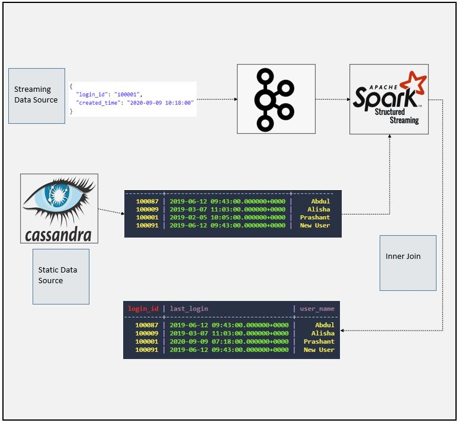
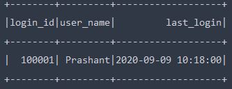

# SparkStream Join Example with Static Source From Cassandra
### Dataflow Pipeline


### Summary

In this application static old data from cassandra db will be joined with the streaming real time data to update last login timestamp data inside of the cassandra. Simply this is static data and streaming data join example using structural streaming api of spark.
### Task List

- [x] Create cassandra keyspace and insert static data from data folder

```
cqlsh> CREATE KEYSPACE spark_db WITH replication = {'class': 'SimpleStrategy','replication_factor':1};
cqlsh> USE spark_db;
cqlsh:spark_db> CREATE TABLE users(login_id text PRIMARY KEY, user_name text, last_login timestamp);
cqlsh:spark_db> INSERT INTO users (Login_id, user_name, last_login) VALUES( '100001', 'Prashant', '2019-02-05 10:05:00');
cqlsh:spark_db> INSERT INTO users (Login_id, user_name, last_login) VALUES( '100009', 'Alisha', '2019-03-07 11:03:00');
cqlsh:spark_db> INSERT INTO users (Login_id, user_name, last_login) VALUES( '100087', 'Abdul', '2019-06-12 09:43:00');
cqlsh:spark_db> INSERT INTO users (Login_id, user_name, last_login) VALUES( '100091', 'New User', '2019-06-12 09:43:00');
```

- [x] Create kafka topic

- [x] Initialize spark session and define cassandra config
```
val spark = SparkSession.builder()
  .master("local[3]")
  .appName("Stream Table Join Demo")
  .config("spark.streaming.stopGracefullyOnShutdown", "true")
  .config("spark.sql.shuffle.partitions", 2)
  .config("spark.cassandra.connection.host", "localhost")
  .config("spark.sql.extensions", "com.datastax.spark.connector.CassandraSparkExtensions")
  .config("spark.sql.catalog.lh", "com.datastax.spark.connector.datasource.CassandraCatalog")
  .getOrCreate()
```
- [x] Define schema
```
val loginSchema = StructType(List(
     StructField("created_time", StringType),
     StructField("login_id", StringType)
   ))
```
- [x] Read streaming data
```
val kafkaSourceDF = spark
    .readStream
    .format("kafka")
    .option("kafka.bootstrap.servers", "localhost:5052")
    .option("subscribe", "logins")
    .option("startingOffsets", "earliest")
    .load()

  val valueDF = kafkaSourceDF.select(from_json(col("value").cast("string"), loginSchema).alias("value"))
  val loginDF = valueDF.select("value.*")
    .withColumn("created_time", to_timestamp(col("created_time"), "yyyy-MM-dd HH:mm:ss"))
```
- [x] Read static data from cassandra and perform join operation
```
val userDF = spark.read
     .format("org.apache.spark.sql.cassandra")
     .option("keyspace", "spark_db")
     .option("table", "users")
     .load()

   val joinExpr = loginDF.col("login_id") === userDF.col("login_id")
   val joinType = "inner"

   val joinedDF = loginDF.join(userDF, joinExpr, joinType)
     .drop(loginDF.col("login_id"))

   val outputDF = joinedDF.select(col("login_id"), col("user_name"),
     col("created_time").alias("last_login"))
```
- [x] Define foreachBatch function for custom sink operation
```
def writeToCassandra(outputDF: DataFrame, batchID: Long): Unit = {
  outputDF.write
    .format("org.apache.spark.sql.cassandra")
    .option("keyspace", "spark_db")
    .option("table", "users")
    .mode("append")
    .save()

```
- [x] Start streaming
```
val outputQuery = outputDF.writeStream
  .foreachBatch(writeToCassandra _)
  .outputMode("update")
  .option("checkpointLocation", "chk-point-dir")
  .trigger(Trigger.ProcessingTime("1 minute"))
  .start()

logger.info("Waiting for Query")
outputQuery.awaitTermination()

```
- [x] Check output from console


